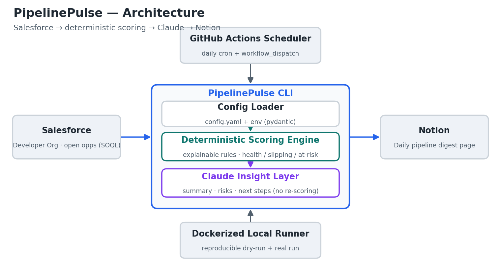
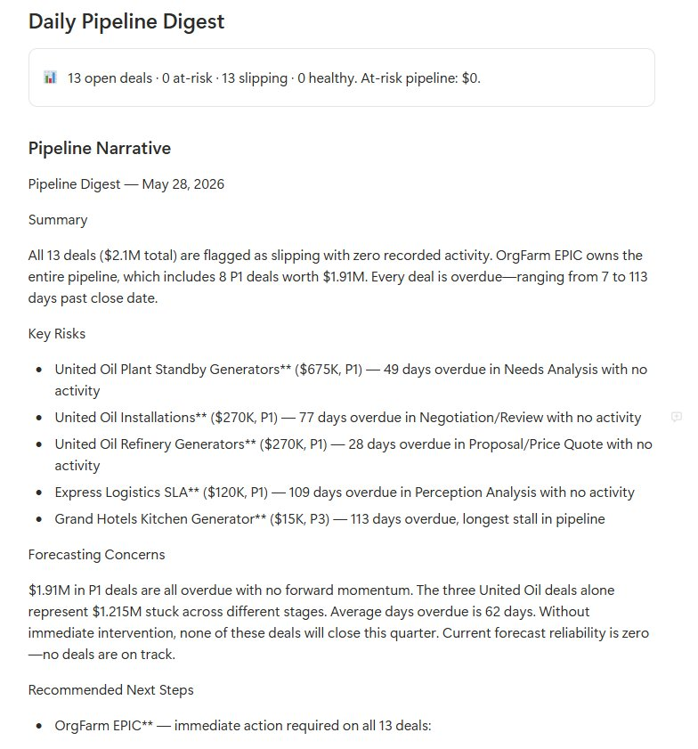

# PipelinePulse

**An AI sales-ops automation that turns a noisy Salesforce pipeline into a daily, decision-ready digest in Notion.**


PipelinePulse pulls open opportunities from Salesforce, scores deal health with **deterministic, explainable rules**, and uses **Claude** to write a plain-English pipeline digest with recommended next actions — then posts it to **Notion** every morning. The math stays deterministic; the LLM only handles language.

---

## The problem

Sales managers lose hours every week manually reviewing the pipeline: clicking through Salesforce, eyeballing close dates, guessing which deals have gone quiet, and re-typing the same "what's slipping?" summary into Slack or Notion. It's slow, inconsistent, and easy to miss the deal that just went cold.

## The solution

PipelinePulse automates that review. It runs on a schedule, applies a consistent set of deal-health rules, and produces a digest a revenue team can act on in two minutes:

- **Less manual work** — no more clicking through every opportunity.
- **Consistent risk signals** — the same rules applied every day, not gut feel.
- **Better visibility** — at-risk exposure and next steps surfaced in Notion where the team already works.

## Architecture



```
Salesforce (open opps via SOQL)
        │
        ▼
PipelinePulse CLI ── Config Loader (config.yaml + env)
        │
        ├─▶ Deterministic Scoring Engine  → health / slipping / at-risk
        │
        └─▶ Claude Insight Layer          → summary, risks, next steps
        │
        ▼
Notion (daily pipeline digest page)

Scheduled by GitHub Actions · runs reproducibly in Docker
```

## Features

- **Salesforce integration** via `simple-salesforce` (open opportunities only, `IsClosed = false`).
- **Deterministic deal-health scoring** — explainable rules for activity staleness, close-date slip, stage age, and amount weighting. Every score comes with `risk_reasons` and a `recommended_priority` (P1/P2/P3).
- **Claude-generated narrative** — summary, key risks, forecasting concerns, and a next step per flagged deal. The LLM **never** recomputes the score.
- **Notion publishing** — a formatted digest page with a callout summary and per-deal blocks. Large digests are batched in groups of 100 blocks per request to stay within the Notion API limit.
- **Offline demo mode** — runs end-to-end with bundled mock data and no credentials.
- **Graceful degradation** — if the Claude API is unavailable, a deterministic fallback digest is still produced.
- **Config-driven** — thresholds and weights live in `config.yaml`, not in code.
- **Tested, Dockerized, and scheduled** — `pytest` suite, a slim image, and a daily GitHub Actions workflow.

## Quickstart

```bash
git clone https://github.com/danielfmonzon/pipelinepulse.git
cd pipelinepulse

python -m venv .venv && source .venv/bin/activate
pip install -e ".[dev]"

# Run the full pipeline offline with mock data — no credentials needed:
pipelinepulse --dry-run --use-mock-data
```

## Environment variables

Secrets are read from the environment only — never from `config.yaml`. Copy `.env.example` to `.env` and fill in:

| Variable | Purpose |
| --- | --- |
| `SF_USERNAME` / `SF_PASSWORD` / `SF_SECURITY_TOKEN` | Salesforce auth |
| `SF_DOMAIN` | `login` (prod/dev) or `test` (sandbox) |
| `ANTHROPIC_API_KEY` | Claude API |
| `NOTION_API_KEY` | Notion integration token |
| `NOTION_DATABASE_ID` | Target Notion database for the digest |

## Salesforce setup notes

1. Create a free [Salesforce Developer Edition](https://developer.salesforce.com/signup) org.
2. Reset your security token (Settings → Reset My Security Token); it arrives by email.
3. Add a few open Opportunities with varied stages, amounts, and close dates.
4. PipelinePulse queries `Name, StageName, Amount, CloseDate, LastActivityDate, CreatedDate, Owner.Name` where `IsClosed = false`. Field API names are configurable in `config.yaml`.

## Notion setup notes

1. Go to [notion.so/profile/integrations](https://www.notion.so/profile/integrations) and create a new internal connection. Choose **Access token** (workspace-scoped) — not OAuth — and copy the token into `NOTION_API_KEY`.
2. Create a full-page database (e.g. "Pipeline Digests") and attach a **data source** to it. Keep the title column named **Name**.
3. From the database's ••• menu, open **Connections** and connect your integration.
4. Copy the database ID from its URL into `NOTION_DATABASE_ID` — it's the 32-character string immediately before `?v=`.

## Dry-run demo

```bash
pipelinepulse --dry-run --use-mock-data
```

`--dry-run` prints the digest to the console and never touches Notion. `--use-mock-data` loads the bundled fixture with a fixed reference date, so the demo is fully reproducible.

## Example output

```
========================================================================
  PIPELINEPULSE — DAILY DIGEST (2025-06-16)
========================================================================
  9 open deals  |  at-risk: 3  slipping: 3  healthy: 3
  Total pipeline: $1,047,000  |  at-risk exposure: $498,000
========================================================================

FLAGGED DEALS
------------------------------------------------------------------------
[P1] Vertex Holdings - Enterprise Rollout  (at-risk, score 10)
     owner=Dana Whitfield  amount=$400,000  stage=Qualification  close=2025-06-06
     risk: No activity in 49 days (critical).; Close date is 10 days overdue.;
           Open 116 days but still early-stage ('Qualification').; High-value deal with open risks — prioritize.
     next: Re-baseline close date with Dana Whitfield; confirm the deal is still live.

[P1] Orion Systems - Data Migration  (slipping, score 65)
     owner=Priya Nair  amount=$180,000  stage=Proposal/Price Quote  close=2025-06-19
     risk: No activity in 18 days.; Close date in 3 days but still in 'Proposal/Price Quote'.
     next: Priya Nair to re-engage — no contact in 18 days.
```

(With `ANTHROPIC_API_KEY` set, the digest also includes a Claude-written narrative: Summary, Key Risks, Forecasting Concerns, and Recommended Next Steps.)

## Live Notion digest

Posted automatically to a Notion database from live Salesforce data — deterministic health scores plus a Claude-written narrative (Summary, Key Risks, Forecasting Concerns, Recommended Next Steps):



## Prompt framework

The Claude layer uses a single, versionable prompt template (`src/pipelinepulse/ai_insights.py`). It feeds the model the **already-scored** deals and constrains it to language only:

```text
You are a sales-operations analyst writing a concise daily pipeline digest
for a revenue team...

GROUND RULES
- The deal statuses and health scores below were computed by a deterministic
  rules engine. Treat them as fixed facts. Do NOT recalculate, second-guess, or
  invent new scores.
- Only discuss the deals provided. Do not fabricate deals, names, or numbers.

SCORED DEALS (JSON)
{deals_json}

TASK
1. Summary  2. Key Risks  3. Forecasting Concerns  4. Recommended Next Steps
```

This separation is the core design decision (see below).

## Configuration

All tunable behavior lives in `config.yaml`:

- **`salesforce_fields`** — map logical fields to your org's API field names.
- **`scoring`** — health thresholds, activity/close-date/stage penalties, amount tiers.
- **`notion`** — digest title, max flagged deals, whether to include healthy deals.
- **`ai`** — Claude model, max tokens, temperature.
- **`demo`** — fixed reference date for reproducible mock runs.

Change the rules without touching code — e.g. raise `stale_days_critical`, or lower the `at_risk` threshold for a more conservative read.

## Testing

```bash
pip install -e ".[dev]"
pytest -q
```

Tests cover deal classification (healthy / slipping / at-risk), risk-reason generation, amount weighting, and the AI layer (prompt construction, deterministic pass-through, a mocked Claude response, and graceful API-error handling). No live credentials are required.

## Docker

```bash
# Credential-free demo:
docker compose run --rm demo

# Real run (reads ./.env):
docker compose run --rm digest
```

No secrets are baked into the image; credentials are passed at runtime.

## GitHub Actions scheduled run

`.github/workflows/daily-digest.yml` runs tests on every trigger, then publishes the digest on a weekday cron (and on manual `workflow_dispatch`). Add your credentials as repository **Actions secrets** (`SF_USERNAME`, `SF_PASSWORD`, `SF_SECURITY_TOKEN`, `SF_DOMAIN`, `ANTHROPIC_API_KEY`, `NOTION_API_KEY`, `NOTION_DATABASE_ID`). Without secrets, the workflow safely falls back to the offline mock dry-run.

## Project structure

```
pipelinepulse/
├── README.md
├── Dockerfile
├── docker-compose.yml
├── pyproject.toml
├── requirements.txt
├── requirements-dev.txt
├── config.yaml
├── .env.example
├── .github/workflows/daily-digest.yml
├── src/pipelinepulse/
│   ├── __init__.py
│   ├── main.py              # CLI entrypoint / orchestration
│   ├── salesforce_client.py # SOQL pull + Opportunity model
│   ├── scoring.py           # deterministic deal-health engine
│   ├── ai_insights.py       # Claude prompt + narrative
│   ├── notion_writer.py     # Notion digest publishing
│   └── config.py            # pydantic config models + loader
├── tests/
│   ├── fixtures/mock_opportunities.json
│   ├── test_scoring.py
│   └── test_ai_insights.py
└── docs/
    ├── architecture.png
    └── generate_architecture.py
```

## Why deterministic scoring + LLM summarization

Deal health is a numbers problem: days idle, days to close, stage age, amount. Those should be computed by rules that are **explainable, reproducible, and testable** — a sales leader can trust a score they can trace. LLMs are great at *language*, not arithmetic or risk math, and asking one to "score" deals invites silent drift and hallucinated numbers.

So PipelinePulse draws a hard line: the **scoring engine** owns every number and status, and **Claude** only translates that into a readable narrative and concrete next steps. The prompt explicitly forbids re-scoring. You get reliable signals *and* a digest people will actually read — and if the API ever fails, the deterministic fallback still ships a usable report.

## Roadmap

- Trend tracking (week-over-week health changes per deal).
- Slack delivery alongside Notion.
- Per-owner digest segmentation.
- Configurable scoring profiles (conservative / aggressive).
- Optional write-back of priority flags to Salesforce.

## License

MIT — see [LICENSE](LICENSE).
